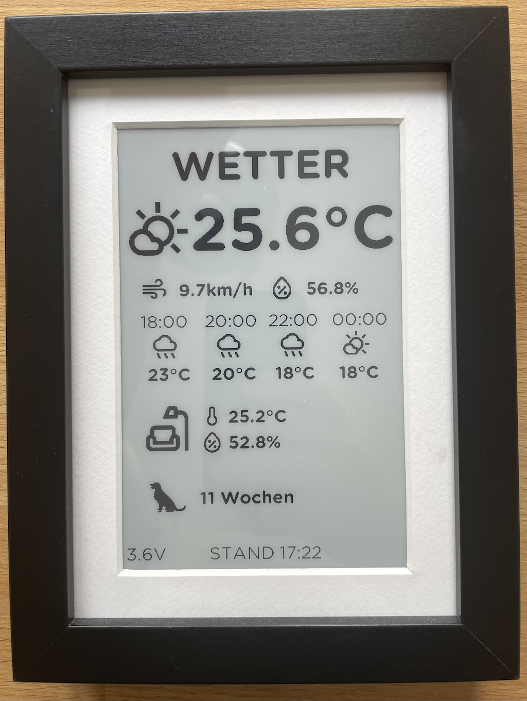

# NRF52840 ePaper Weather Dashboard - BLE + battery-driven

Inspired by [Weatherman Dashboard for ESPHome](https://github.com/Madelena/esphome-weatherman-dashboard).

Based on my previous project [esp8266-epaper](https://github.com/alexander-toch/esp8266-epaper)




## Features

- VERY low power consumption (22.5uA during the sleep phase)
- [bless](https://github.com/kevincar/bless)-based BLE server fetching the altest data from Home Assistant and exposing it as BLE Characteristics
- Auto-refresh current weather and HA sensor data via BLE
- 🔋 Voltage Indicator 


## Hardware

- Seeed Studio XIAO nRF52840 [link] (https://www.seeedstudio.com/Seeed-XIAO-BLE-nRF52840-p-5201.html)
- Waveshare 13187 7.5inch e-Paper [link](https://www.welectron.com/Waveshare-13187-75inch-e-Paper)
- aveshare e-Paper Driver HAT Rev2.3 [link](https://www.amazon.de/gp/product/B075XRVNYZ/)
- IKEA Ribba frame [link](https://www.ikea.com/at/de/p/ribba-bilderrahmen-schwarz-50378448/)
- 2500mAH Lithium-Polymer battery [link](https://www.berrybase.at/lp-785060-lithium-polymer/lipo-akku-3-7v-2500mah-mit-2-pin-jst-stecker)

### Wiring

```
//  MCU: Xiao Nrf52840 Sense	
//  Driver: Waveshare e-Paper Driver HAT Rev2.3
//  SIGNAL	color       		NAME      	PIN  	PORT
//  -------------------------------------------
//  BUSY     	Purple	  	D3            	4	    	P0.29
//  RST     	White    	D4  (SDA)     	5    		P0.05
//  DC      	Green	  	D5  (SCL)     	6    		P0.04
//  CS	    	Orange	 	D7  (RXD)     	8    		P1.12
//  CLK	    	Yellow	  	D8  (SCLK)    	9    		P1.13
//  DIN	    	BLUE	  	D10 (MOSI)   	11    		P1.15
//  GND		    BROWN		GND	            13
//  VCC		    GRAY		3V3 	      	12
//  PWR 		RED			D0			    0		    P0.02
```

## Software

- `Arduino`
- `GxEPD2` for controllling and drawing on the ePaper
- `ArduinoJson` for decoding the response from Home Assistant
- [fonctconvert](https://github.com/adafruit/Adafruit-GFX-Library/tree/master/fontconvert) from AdafruitGFX to convert fonts to header files
- `rsvg-convert` to convert [Material Icons](https://fonts.google.com/icons) svg to png (with `find . -type f -name "*.svg" -exec bash -c 'rsvg-convert -h 512 "$0" > "$0".png' {} \;`)
- [image2cpp](https://javl.github.io/image2cpp/) for converting the created png files to header files with bitmaps


## Installation
- Get latest bootloader from [here](https://github.com/adafruit/Adafruit_nRF52_Bootloader/releases) (i.e., update-xiao_nrf52840_ble_bootloader-0.8.3_nosd.uf2) and copy file onto MCU. Very important to get the low power consumption working!
- **TODO** (platformio setup, HA configuration, systemd service for epaper BLE service)

## Useful links

- https://wiki.seeedstudio.com/XIAO_BLE/
- https://infocenter.nordicsemi.com/pdf/nRF52840_PS_v1.7.pdf
- https://forum.seeedstudio.com/t/getting-lower-power-consumption-on-seeed-xiao-nrf52840/270129
- https://github.com/adafruit/Adafruit_nRF52_Arduino/issues/743
- https://github.com/platformio/platform-nordicnrf52/pull/151
- https://forums.adafruit.com/viewtopic.php?t=128823
- https://github.com/adafruit/Adafruit_nRF52_Bootloader/releases
- https://files.waveshare.com/upload/4/4e/2.13inch_e-Paper_V4_Specification.pdf