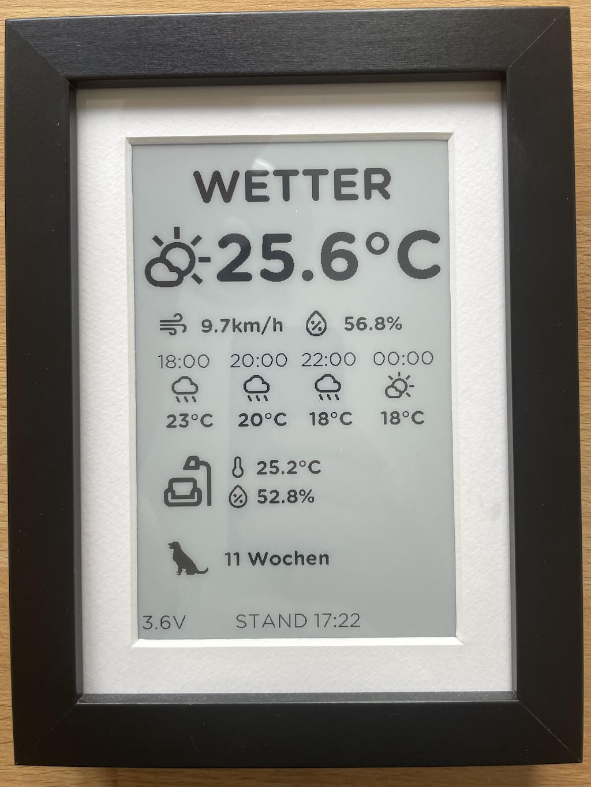

# nRF52840 ePaper Weather Dashboard — BLE + battery-driven

A low-power weather & Home Assistant dashboard on a 7.5" ePaper display, driven
by a Seeed XIAO nRF52840 over BLE and powered from a LiPo battery.

Inspired by [Weatherman Dashboard for ESPHome](https://github.com/Madelena/esphome-weatherman-dashboard).
Based on my previous project [esp8266-epaper](https://github.com/alexander-toch/esp8266-epaper).



## Features

- VERY low power consumption (~22.5 µA during the sleep phase)
- [bless](https://github.com/kevincar/bless)-based BLE server that fetches the
  latest data from Home Assistant and exposes it as BLE Characteristics
- Auto-refresh of current weather and HA sensor data via BLE
- 🔋 Battery voltage indicator
- Two hardware paths behind one drawing codebase (see
  [Display backends](#display-backends))

## Hardware

### Main target — XIAO ePaper Display Board EN04

The recommended build uses Seeed's all-in-one ePaper carrier board:

- **[Seeed Studio XIAO ePaper Display Board EN04](https://wiki.seeedstudio.com/epaper_EN04/)**
  (carries a XIAO nRF52840 Plus, with the FPC connector, battery JST + switch and
  user buttons on board)
- **7.5" monochrome ePaper panel, 800×480, UC8179** (`BOARD_SCREEN_COMBO 502`)
- Driven by the **[Seeed_GFX](https://github.com/Seeed-Studio/Seeed_GFX)** library
- LiPo battery (JST 2.0 mm) + IKEA Ribba frame

This path replaces the separate driver HAT and ribbon wiring below — the panel
plugs straight into the board's FPC connector. Mind the FPC cable orientation:
a reversed connection can damage the panel.

### Legacy target — XIAO nRF52840 + Waveshare HAT

The original discrete setup, still supported:

- [Seeed Studio XIAO nRF52840](https://www.seeedstudio.com/Seeed-XIAO-BLE-nRF52840-p-5201.html)
- [Waveshare 13187 7.5" e-Paper](https://www.welectron.com/Waveshare-13187-75inch-e-Paper)
- [Waveshare e-Paper Driver HAT Rev2.3](https://www.amazon.de/gp/product/B075XRVNYZ/)
- [IKEA Ribba frame](https://www.ikea.com/at/de/p/ribba-bilderrahmen-schwarz-50378448/)
- [2500 mAh LiPo battery](https://www.berrybase.at/lp-785060-lithium-polymer/lipo-akku-3-7v-2500mah-mit-2-pin-jst-stecker)

## Software

- `Arduino` (Adafruit nRF52 core) + `bluefruit` for BLE
- **[Seeed_GFX](https://github.com/Seeed-Studio/Seeed_GFX)** — display driver for
  the EN04 board (main target)
- `GxEPD2` — display driver for the legacy Waveshare HAT
- `ArduinoJson` for decoding the Home Assistant response
- [fontconvert](https://github.com/adafruit/Adafruit-GFX-Library/tree/master/fontconvert)
  to convert fonts to Adafruit-GFX header files
- `rsvg-convert` to convert [Material Icons](https://fonts.google.com/icons) SVGs
  to PNG (`find . -type f -name "*.svg" -exec bash -c 'rsvg-convert -h 512 "$0" > "$0".png' {} \;`)
- [image2cpp](https://javl.github.io/image2cpp/) to turn PNGs into bitmap headers

## Build targets

Build with [PlatformIO](https://platformio.org/):

```bash
pio run -e xiao_epaper_en04       # main: EN04 board + Seeed_GFX
pio run -e xiaoble_arduinocore    # legacy: XIAO nRF52840 + Waveshare HAT + GxEPD2
```

| Environment                     | Board                      | Display library |
| ------------------------------- | -------------------------- | --------------- |
| `xiao_epaper_en04` (**main**)   | XIAO nRF52840 Plus (EN04)  | Seeed_GFX       |
| `xiaoble_arduinocore`           | XIAO nRF52840              | GxEPD2          |
| `xiaoblesense_arduinocore`      | XIAO nRF52840 Sense        | GxEPD2          |
| `xiaoblesense_arduinocore_mbed` | XIAO nRF52840 Sense (mbed) | GxEPD2          |

Notes on the EN04 target:

- The panel/board combo is configured in [`include/driver.h`](include/driver.h):
  ```c
  #define BOARD_SCREEN_COMBO 502 // 7.5 inch monochrome ePaper Screen (UC8179)
  #define USE_XIAO_EPAPER_DISPLAY_BOARD_EN04
  ```
- The EN04 carries a XIAO nRF52840 **Plus**, which exposes extra pins (D11..D19).
  There is no stock PlatformIO variant for it, so the Plus Arduino variant is
  vendored under [`variants/Seeed_XIAO_nRF52840_Plus/`](variants/Seeed_XIAO_nRF52840_Plus)
  and selected via `board_build.variant` in [`platformio.ini`](platformio.ini).
- [`include/Seeed_Arduino_FS.h`](include/Seeed_Arduino_FS.h) is a deliberate
  empty stub — Seeed_GFX includes it on nRF52840 for filesystem smooth-fonts we
  don't use; see the file header for details.

## Display backends

The dashboard drawing code talks to one small facade,
[`src/display/display.h`](src/display/display.h), and the build selects a backend:

- [`src/display/display_seeedgfx.cpp`](src/display/display_seeedgfx.cpp) — EN04 /
  Seeed_GFX (full-frame sprite). It ports Adafruit-GFX's exact glyph rasteriser
  and text-metrics so the layout renders 1:1 with the GxEPD2 path.
- [`src/display/display_gxepd2.cpp`](src/display/display_gxepd2.cpp) — Waveshare
  HAT / GxEPD2 (paged rendering).

`epd::render(drawFn)` hides the paged-vs-sprite difference so the layout is
written once in [`src/main.cpp`](src/main.cpp).

## Wiring (legacy Waveshare HAT)

```
//  MCU: XIAO nRF52840 (Sense)
//  Driver: Waveshare e-Paper Driver HAT Rev2.3
//  SIGNAL      color           NAME            PIN     PORT
//  -------------------------------------------
//  BUSY        Purple          D3              4       P0.29
//  RST         White           D4  (SDA)       5       P0.05
//  DC          Green           D5  (SCL)       6       P0.04
//  CS          Orange          D7  (RXD)       8       P1.12
//  CLK         Yellow          D8  (SCLK)      9       P1.13
//  DIN         Blue            D10 (MOSI)      11      P1.15
//  GND         Brown           GND             13
//  VCC         Gray            3V3             12
//  PWR         Red             D0              0       P0.02
```

For the EN04 board the panel connects via the on-board FPC connector; the pin
map (CS D7, DC D16, BUSY D3, RST D11, SCLK D8, MOSI D10, power-enable D6) is
defined by Seeed_GFX for `USE_XIAO_EPAPER_DISPLAY_BOARD_EN04`.

> ⚠️ The EN04 battery sense pins and divider ratio in
> [`src/main.cpp`](src/main.cpp) are best-effort from the EN04 wiki and are
> flagged `TODO(EN04)` — verify them against your board before trusting the
> reported voltage.

## Installation

- Get the latest bootloader from
  [Adafruit_nRF52_Bootloader releases](https://github.com/adafruit/Adafruit_nRF52_Bootloader/releases)
  (e.g. `update-xiao_nrf52840_ble_bootloader-0.8.3_nosd.uf2`) and copy it onto
  the MCU. This is important for getting the low power consumption working.
- Build and upload the matching environment (double-tap reset to enter the
  UF2 bootloader):
  ```bash
  pio run -e xiao_epaper_en04 -t upload
  ```
- **TODO**: HA configuration, systemd service for the ePaper BLE service.

## Useful links

- https://wiki.seeedstudio.com/epaper_EN04/ — XIAO ePaper Display Board EN04
- https://github.com/Seeed-Studio/Seeed_GFX — Seeed_GFX library
- https://wiki.seeedstudio.com/XIAO_BLE/
- https://infocenter.nordicsemi.com/pdf/nRF52840_PS_v1.7.pdf
- https://forum.seeedstudio.com/t/getting-lower-power-consumption-on-seeed-xiao-nrf52840/270129
- https://github.com/adafruit/Adafruit_nRF52_Bootloader/releases
